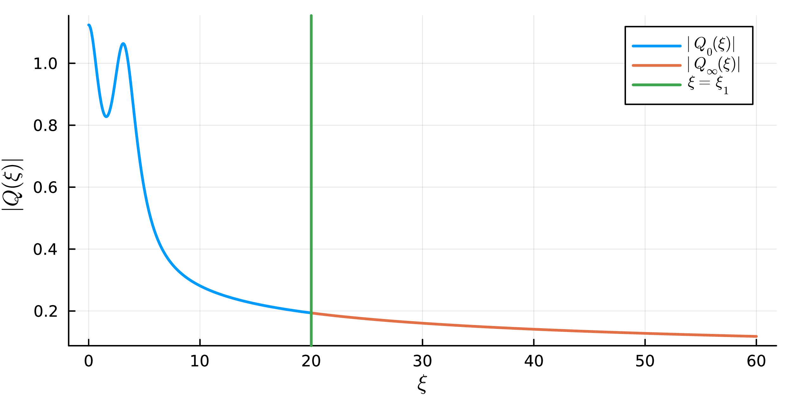

# Week 10 Lecture 2: Self-similar blowup

In this lecture we will take a look at the paper [Self-Similar
Singular Solutions to the Nonlinear Schrödinger and the Complex
Ginzburg-Landau Equations](https://arxiv.org/abs/2410.05480). The
focus will be on the proof and the computer-assisted approach, we will
only briefly discuss the history of the problem.

## Background

We are interested in the complex Ginzburg-Landau (CGL) equation. It is
given by

``` math
i \frac{\partial u}{\partial t} + (1 - i\epsilon)\Delta u + (1 + i\delta)|u|^{2\sigma}u = 0
\text{ in }\mathbb{R}^{d} \times (0, T),
```

for parameters non-negative parameters ``\epsilon``, ``\delta`` and
``\sigma``. For ``\epsilon = 0`` and ``\delta = 0`` it reduces to the
more well known nonlinear Schrödinger (NLS) equation. In particular,
for ``\sigma = 1`` we get the cubic NLS equation

``` math
i \frac{\partial u}{\partial t} + \Delta u + |u|^{2}u.
```

The parameters considered in the paper are ``\delta = 0`` and
``\epsilon > 0``. In our discussions here we will in some cases
further specialize to ``\epsilon = 0``, ``\sigma = 1`` and ``d = 3``
(the 3D cubic NLS equation), which simplifies some of the technical
details.

We are interested in radial (backward) self-similar solutions. These
are solutions of the form

``` math
u(x, t) = \dfrac{1}{(2\kappa(T - t))^{\frac{1}{2}\left(\frac{1}{\sigma} + i \frac{\omega}{\kappa}\right)}}
Q\left(\dfrac{|x|}{(2\kappa(T - t))^{\frac{1}{2}}}\right),
```

for some real valued parameters ``\kappa`` and ``\omega``. Inserting
this ansatz into the CGL equation we get that ``Q`` should satisfy the
ODE

``` math
(1 - i\epsilon)\left(Q'' + \frac{d - 1}{\xi}Q'\right) + i\kappa\xi Q'
+ i \frac{\kappa}{\sigma}Q - \omega Q + (1 + i\delta)|Q|^{2\sigma}Q
= 0
```

For ``Q`` to give a smooth radial solution we have the boundary
condition ``Q'(0) = 0``. For the solution to have finite energy we
will also need the condition that ``Q(\xi) \sim
\xi^{-\frac{1}{\sigma} - i\frac{\omega}{\kappa}}`` as ``\xi \to
\infty``, we will get back to where this comes from. Due to a scaling
symmetry between ``\kappa`` and ``\omega``, we are free to fix
``\omega = 1``. In general we will, however, still keep ``\omega`` in
the expressions.

In general, for arbitrary values of ``\kappa`` (and ``\omega = 1``),
this boundary value problem will not have solutions. Only for a
discrete set of values do solutions exist. The existence of (some of)
these solutions is what we want to prove.

From now on, we will forget everything about the CGL equation, the NLS
equation and self-similar solutions. Our only goal is to prove the
existence of ``\kappa`` values such that the above ODE have solutions
satisfying the boundary conditions at zero and infinity.

## A rigorous shooting method

To prove the existence of a solution we will apply what in numerical
analysis is called the shooting method. We will look at two solutions,
one shooting out from zero and one shooting out from infinity. We will
then look for ``\kappa`` so that these two solutions match at some
intermediate point, forming a global solution.

The idea is visualized in the figure below. Here ``Q_0`` is the
solution shooting out from zero and ``Q_\infty`` is the solution
shooting out from infinity. The matching point, ``\xi_1``, is marked
by the green line. Matching the solutions means that they should agree
at the point ``\xi_1``.



!!! note "Remark"
    The plot above is for a different set of parameters than the one
    we will focus on here. The approach is the same though.

The solution ``Q_0`` is the unique solution to the initial value
problem

``` math
\begin{split}
  (1 - i\epsilon)\left(Q_{0}'' + \frac{d - 1}{\xi}Q_{0}'\right) + i\kappa\xi Q_{0}'
  + i \frac{\kappa}{\sigma}Q_{0} - \omega Q_{0} + (1 + i\delta)|Q_{0}|^{2\sigma}Q_{0}
  &= 0,\\
  Q_{0}(0) = \mu,\\
  Q_{0}'(0) = 0.
\end{split}
```

Here ``\mu`` is a parameter that we are free to vary, any value of
``\mu`` will give us a solution satisfying the right boundary
condition at zero. For symmetry reasons we can take ``\mu`` to be real
and positive. If we also include the solutions dependence on
``\kappa``, this gives us a two-parameter family of solutions. We will
use the notation ``Q_0(\xi) = Q_0(\mu, \kappa; \xi)`` to explicitly
denote this dependence.

The solution ``Q_\infty`` is determined by the condition ``Q(\xi)
\sim \xi^{-\frac{1}{\sigma} - i\frac{\omega}{\kappa}}`` as ``\xi \to
\infty``. In this case it is, however, not quite as straightforward to
parametrize the solution. We will see later that there is a
one-dimensional complex manifold of solutions satisfying this
condition. We will parametrize this manifold by ``\gamma \in
\mathbb{C}``, which together with the solutions dependence on
``\kappa`` gives us ``Q_\infty(\xi) = Q_\infty(\gamma, \kappa; \xi)``.

Note that by construction, the solution ``Q_0`` satisfies the required
boundary condition at zero and the solution ``Q_\infty`` satisfy the
boundary condition at infinity. In general, neither ``Q_0`` nor
``Q_\infty`` will however satisfy both boundary conditions. Our goal
is to find parameters ``(\mu, \gamma, \kappa)`` so that these
solutions can be glued together at some intermediate point ``\xi_1``.
They would then form a global solution satisfying both boundary
conditions. What does it mean to glue them together? The condition we
need is that they satisfy

``` math
\begin{cases}
  Q_0(\mu, \kappa; \xi_1) = Q_\infty(\gamma, \kappa; \xi_1) &= 0,\\
  Q_0'(\mu, \kappa; \xi_1) = Q_\infty'(\gamma, \kappa; \xi_1) &= 0.
\end{cases}
```

This condition means that ``Q_0`` and ``Q_\infty`` both are solutions
to the same second order ODE and that they have the same initial
conditions at the point ``\xi_1``. It then follows by the existence
and uniqueness theorem for ODEs that they are in fact the same
solution and hence glue together.

To verify this gluing condition we introduce the function

``` math
G(\mu, \gamma, \kappa) = \left(
  Q_{0}(\mu, \kappa; \xi_{1}) - Q_{\infty}(\gamma, \kappa; \xi_{1}),
  Q_{0}'(\mu, \kappa; \xi_{1}) - Q_{\infty}'(\gamma, \kappa; \xi_{1})
\right) : \mathbb{R} \times \mathbb{C} \times \mathbb{R} \to \mathbb{C}^{2}.
```

By identifying \(\mathbb{C}\) with \(\mathbb{R}^{2}\) we can interpret
\(G\) as a map from \(\mathbb{R}^{4}\) to \(\mathbb{R}^{4}\).

``` math
G(\mu, \operatorname{Re} \gamma, \operatorname{Im} \gamma, \kappa)  :\mathbb{R}^{4} \to \mathbb{R}^{4}.
```

A matching of the solutions ``Q_0`` and ``Q_\infty`` corresponds to a
zero of the function ``G``. We have hence reduced the problem of
finding a solution to the ODE satisfying both the boundary condition
at zero and at infinity to proving the existence of a zero for this
function.

To apply this method we need to discuss two things:

1. How to isolate roots for functions of several variables.
2. How to compute ``G`` (and its derivatives) using interval
   arithmetic.

The evaluation of ``G`` naturally splits into the evaluation of
``Q_0`` and the evaluation of ``Q_\infty``, so we will consider them
separately.

## Isolating roots in ``\mathbb{R}^d``

For proving the existence (and local uniqueness) of a zero of ``G`` we
will make use of a high dimensional version of the interval Newton
method.

Recall that the one dimensional version of the interval Newton method
is defined by the Newton operator

``` math
N(\bm{x}) = m - \frac{f(m)}{f'(\bm{x})}.
```

Here ``\bm{x}`` is an interval and ``m`` is a point (usually the
midpoint) in the interval. The most important property of ``N`` is
that if ``N(\bm{x}) \subseteq \bm{x}``, then the function ``f`` has a
unique root on the interval ``\bm{x}``.

The generalization of the interval Newton method to higher dimensions
only requires changing the derivative to the Jacobian. Of ``Df``
denotes the Jacobian of ``f``, then the higher dimensional version of
the Newton operator is

``` math
N(\bm{x}) = m - Df(\bm{x})^{-1}f(m).
```

Where ``\bm{x} = \bm{x}_1 \times \cdot \times \bm{x}_d`` is a box
given by a Cartesian product of intervals and ``m`` is (usually) the
midpoint of this box. We then have the following result.

!!! note "Theorem"
    Assume that ``N(\bm{x})`` is well-defined. If ``N(\bm{x})
    \subseteq \bm{x}``, then ``\bm{x}`` contains exactly one zero of
    ``f``.

Let us sketch a proof of this, starting with the existence of at least
one root.

!!! note "Proof of existence"
    Let us start by noting that we can express the difference between the
    function at ``x`` and at ``m`` by

    ``` math
    f(x) - f(m) = J(x)(x - m),
    ```

    where

    ``` math
    J(x) = \int_0^1 Df(m + t(x - m))\,dt.
    ```

    The crucial observation is that ``J(x) \in Df(\bm{x})`` for any
    ``x \in \bm{x}``. This follows from the fact that ``\bm{x}`` is
    convex, so the path of integration stays inside the box, and the
    inclusion ``Df(m + t(x - m)) \in Df(\bm{x})``.

    To prove the existence we will apply a fixed point theorem to the
    function

    ``` math
    g(x) = m - J(x)^{-1}f(m).
    ```

    Since ``J(x) \subseteq Df(\bm{x})`` we have, by assumption,

    ``` math
    g(x) = m - J(x)^{-1}f(m) \in m - Df(\bm{x})f(m) = N(\bm{x}) \subseteq \bm{x}
    ```

    for any ``x \in \bm{x}``. Hence, ``g(\bm{x}) \subseteq \bm{x}`` and it
    follows by the Brouwer fixed point theorem that ``g`` has at least one
    fixed point in ``\bm{x}``.

    What remains is proving that this fixed point is a zero of ``f``. If
    we denote the fixed point by ``x_0``, then

    ``` math
    x_0 = m - J(x_0)^{-1}f(m).
    ```

    Which we can rewrite as

    ``` math
    J(x_0)(x_0 - m) = -f(m).
    ```

    Inserting this into ``f(x) - f(m) = J(x)(x - m)`` we get

    ``` math
    f(x_0) - f(m) = -f(m) \iff f(x_0) = 0.
    ```

The uniqueness follows from the following, slightly more general,
theorem.

!!! note "Theorem"
    If the interval matrix ``Df(\bm{x})`` is invertible, then ``f``
    has at most one zero in the box ``\bm{x}``.

!!! note "Proof"
    Suppose we have two roots, ``x_0`` and ``x_1``, and consider the line
    segment joining them. The proof is based on a multivariable version of
    the mean value theorem. Namely that

    ``` math
    f(x_0) - f(x_1) = J (x_1 - x_0)
    ```

    where ``J`` is the matrix

    ``` math
    J =
    \begin{pmatrix}
      \nabla f_1(c_1)\\ \nabla f_2(c_2)\\ \vdots \\ \nabla f_d(c_d)
    \end{pmatrix},
    ```

    with the points ``c_i`` lying on the line segment between ``x_0`` and
    ``x_1``.

    By assumption we have ``f(x_0) = 0`` and ``f(x_1) = 0``, hence this
    gives us

    ``` math
    J (x_1 - x_0) = 0.
    ```

    The result would therefore follow if we can show that ``J`` is
    invertible, since in that case we get ``x_1 - x_0 = 0`` and hence
    ``x_0 = x_1``. Since ``\bm{x}`` is convex, the line segment between
    ``x_0`` and ``x_1`` lies fully inside the box. Each row of ``J`` will
    therefore be contained in the corresponding row of ``Df(\bm{x})``.
    Since ``Df(\bm{x})`` is invertible by assumption, it follows that
    ``J`` is also invertible.

    The proof of the multivariable version of the mean value theorem
    reduces to applying the mean value theorem separately to each
    component of ``f``. The ``c_i`` points come from each of these
    instances of applying the theorem.

## Evaluating ``Q_0``

## Evaluating ``Q_\infty``
