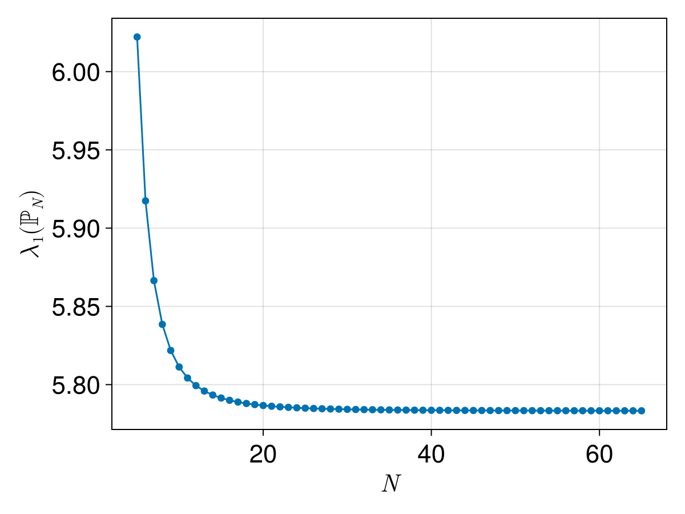
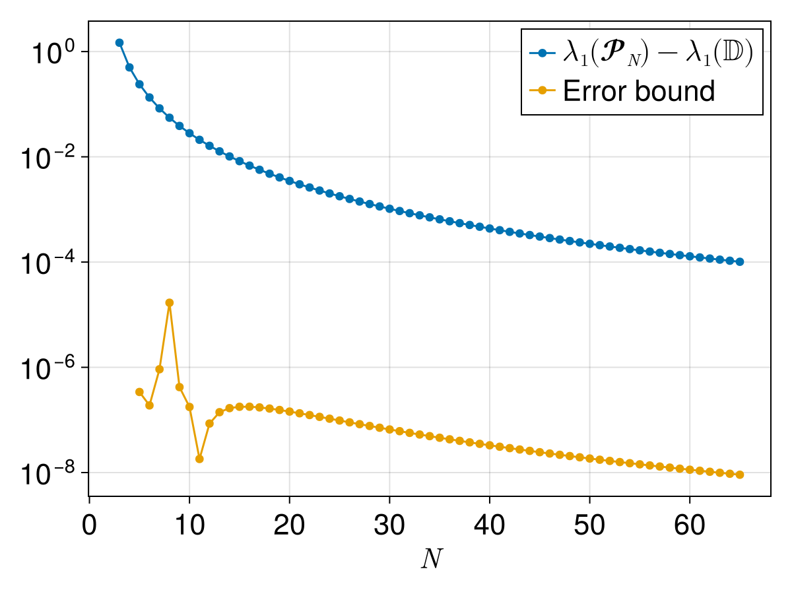

# Week 3 Lecture 1: Computer-assisted proofs for continuous problems

Last week we looked at some examples of computer-assisted proofs for
discrete problems, this included

- The four color theorem
- The boolean Pythagorean triples problem
- Goldbach's weak conjecture

This week we will look at computer-assisted proofs applied to
continuous problems. Since computers are inherently discrete machines,
working with continuous problems require a slightly different
approach.

Computer-assisted proofs are not applicable to all types of problems.
Throughout the course we will talk about what type of problems are
good candidates for computer-assisted proofs and by the end of the
course my hope is that you will have at least a rough idea for when a
computer-assisted proof could be applied to a problem. I have three
guiding principles as to which problems are good candidates for
computer-assisted proofs. For a computer-assisted proof to be
applicable to a problem the result should be:

1. Numerically obvious
2. Stable under perturbations
3. On a compact domain

Expanding a bit on these points:

1. Rigorous numerical methods will never give you better results than
   classical non-rigorous methods.If you cannot produce very
   convincing numerical evidence that the result is true, then any
   attempt to rigorously prove it is doomed to fail.
2. Numerical methods will always produce approximations. Rigorous
   numerical methods can give you bounds for the errors of these
   approximations, but cannot eliminate them. When setting up the
   problem there is however usually a lot of freedom in what type of
   perturbations the result should be stable under.
3. In the end the result needs to reduce to a finite computation and
   that requires some sort of compactness. If you have an infinite
   domain it is in many cases possible to compactify it, usually at
   the cost of introducing singularities at the boundaries that needs
   to be dealt with.

The example we will look at in this lecture is from a recent paper
from my own research and is related to the field of spectral geometry.
We will look at what spectral geometry is, the problem the paper
handle and how it relate to the guiding principles mentioned above.
The paper in question is:

- [Monotonicity of the first Dirichlet eigenvalue of regular
  polygons](https://doi.org/10.48550/arXiv.2601.16285)
  ([code](https://github.com/Joel-Dahne/SpectralRegularPolygon.jl))

Two other papers that make use of similar methods, and which we might
look more at later in the course, are:

- [Computation of Tight Enclosures for Laplacian
  Eigenvalues](https://doi.org/10.1137/20M1326520)
  ([code](https://github.com/Joel-Dahne/MethodOfParticularSolutions.jl))
- [A counterexample to Payne’s nodal line conjecture with few
  holes](https://doi.org/10.1016/j.cnsns.2021.105957)
  ([code](https://github.com/Joel-Dahne/PaynePolygon.jl))


## Spectral geometry

In spectral geometry one study how the eigenvalues and eigenfunctions
of the Laplacian depend on the domain. In our case we are interested
in problems of the form

``` math
\begin{cases}
  -\Delta u = \lambda u &\text{in}\quad \Omega\\
  u = 0 &\text{on}\quad \partial\Omega
\end{cases}.
```

Here ``-\Delta u = \lambda u`` means that ``u`` is an eigenfunction of
the Laplacian, with associated eigenvalue ``\lambda``. Recall that in
the plane, ``\Delta`` is just the sum of the second derivatives

``` math
\Delta u = \frac{\partial^2 u}{\partial x^2} + \frac{\partial^2 u}{\partial y^2}.
```

The eigenvalue equation is then combined with a boundary condition, in
this case ``u = 0`` on the boundary of ``\Omega``. One can consider
other types of boundary conditions, but for our purposes here we will
stay with ``u = 0``, corresponding to a zero Dirichlet boundary
condition.

If ``\Omega`` is reasonably well behaved there is a countable sequence
of eigenvalues, ``\lambda_1 < \lambda_2 \leq \lambda_3 \leq \dots``,
all with an associated eigenfunction ``u_k``. In spectral geometry we
are interested in how these eigenvalues and eigenfunctions depend on
the domain ``\Omega``.

## Monotonicity of the first Dirichlet eigenvalue of regular polygons

Let us start by taking a look at the third paper. In this case we
consider domains ``\mathbb{P}_N`` which are regular polygons and we
are interested in how the first eigenvalue of these polygons,
``\lambda_1(\mathbb{P}_N)`` depend on ``N``. For our purposes we want
to normalize the polygons so that the have area ``\pi``.

If we plot ``\lambda_1(\mathbb{P}_N)`` as a function of ``N`` we the
following picture



From this picture one could maybe conjecture that the eigenvalues are
decreasing with ``N``. This picture is however maybe not the most
convincing, we only go up to ``N = 64`` and for the larger values the
graph mostly looks flat in this plot. To get a slightly better figure
let us start by noting that as ``N`` goes to infinity we would have
that the polygons approach the unit circle. For the unit circle the
eigenvalue can be explicitly computed, it's the first root of the
Bessel function ``J_0``. If we plot the difference between
``\lambda(\mathbb{P}_N)`` and this value and give the y-axis a
logarithmic scale we get (ignore the error bound for now, we will get
back to that).



This is pretty strong numerical evidence for that eigenvalues are
monotone, at least up to ``N = 64``. Of course, a lot of the details
are in how these values are actually computed. There are
approximations errors in these values, can we trust that they are
small enough not to change the conclusion?

Let us consider this problem in terms of the above discussed
guidelines for computer-assisted proofs. Let us start with considering
the project only for the finite set ``N = 3, 4, \dots, 64``.

- Numerically obvious: The above figure gives fairly convincing
  numerical results.
- Stable under perturbations: If we perturb the eigenvalues slightly
  the monotonicity should still hold.
- On a compact domain: When restricted to ``N = 3, 4, \dots, 64`` the
  domain is clearly compact.

This indicates that a computer-assisted proof might be viable. Of
course, for a complete result we need to also handle all ``N \geq
64``. How can we achieve that? The rough idea is to see the
eigenfunctions not as a function of ``N``, but as a function of ``\eta
= \frac{1}{N}``. We then have to prove monotonicity of the eigenvalues
for all ``\eta \in [0, 1/64]``. This gives a compact domain, at the
cost of very singular behavior at ``\eta = 0``.

### Handling ``N = 3, 4, \dots, 64``

Let us focus on the finite case of proving that
``\lambda(\mathbb{P}_N)`` for ``N = 3, 4, \dots, 64``. Handling the
infinite limit builds on some of the same ideas, but requires
significantly more work.

The question to ask is, how were the approximate eigenvalues in the
figures above computed? There are many different ways of numerically
computing eigenvalues, some of them more suited for rigorous
verification.

In this case the computations where the Method of Particular
Solutions, see the paper [Reviving the Method of Particular
Solutions](https://doi.org/10.1137/S0036144503437336) for a more
thorough overview of the method. Recall that we are trying to solve
the equation

``` math
\begin{cases}
  -\Delta u = \lambda u &\text{in}\quad \Omega\\
  u = 0 &\text{on}\quad \partial\Omega
\end{cases}.
```

The idea is to approximate ``u`` using a linear combination of basis
functions,

``` math
u_{app}(x, y) = \sum_{i = 1}^{M} c_i \phi_i(x, y).
```

How should the basis functions ``\phi_i`` and the coefficients ``c_i``
be chosen? The basis functions we choose so that they satisfy the
equation ``-\Delta\phi_{i} = \lambda_{app}\phi_{i}`` **exactly** for
the approximate eigenvalue ``\lambda_{app}``, but they will not
satisfy any specific boundary condition. We then choose the
coefficients ``c_i`` as to make the resulting linear combination as
close on the boundary as possible. This gives us an approximation
``u_{app}``, ``\lambda_{app}`` with

``` math
\begin{cases}
  -\Delta u_{app} = \lambda_{app} u_{app} &\text{in}\quad \Omega\\
  u_{app} \approx 0 &\text{on}\quad \partial\Omega
\end{cases}.
```

The precise choice of ``\phi_i`` depends highly on the domain and we
won't go into the details here. For this specific case the
approximation used is

``` math
u_{app}(x, y) = J_{0}\left(r\sqrt{\lambda}\right)
+ a_{2}J_{N}\left(r\sqrt{\lambda}\right)\cos N\theta
+ \sum_{n = 1}^{N} \left(
  b_{1}J_{\alpha}\left(r_{n}\sqrt{\lambda}\right)\sin \alpha\theta_{n}
  + b_{2}J_{2\alpha}\left(r_{n}\sqrt{\lambda}\right)\sin 2\alpha\theta_{n}
\right).
```

Here ``r`` is the distance from ``(x, y)`` to the center of the
domain, and ``(r_{n}, \theta_{n})`` are the polar coordinates of the
point ``(x, y)`` when centered around vertex ``n`` and the orientation
taken so that ``\theta_{n} = 0`` corresponds to the boundary segment
between vertex ``n`` and ``n + 1``.

So far there is nothing in this approach which is related to rigorous
numerics. This is just a classical numerical approach which we can use
to compute approximations of eigenvalues and eigenfunctions. What
makes this approach suitable for a computer-assisted proof is the
following theorem by Fox, Henrici and Moler.

!!! note "Theorem"
    Let ``\Omega\subset\mathbb{R}^n`` be bounded. Let
    ``\lambda_{app}`` and ``u_{app}`` be an approximate eigenvalue and
    eigenfunction---that is, they satisfy ``\Delta
    u_{app}+\lambda_{app} u_{app}=0`` in ``\Omega`` but not
    necessarily ``u_{app} = 0`` on~``\partial\Omega``. Define

    ``` math
      \mu = \frac{\sqrt{|\Omega|}\sup_{x \in \partial \Omega}|u_{app}(x)|}{\|u_{app}\|_2}.
    ```

    where ``|\Omega|`` is the area of the domain. Then there exists an
    eigenvalue ``\lambda`` such that

    ``` math
      \frac{|\lambda_{app} - \lambda|}{\lambda} \leq \mu.
    ```

The value ``\mu`` measures how close to zero the approximate
eigenfunction is on the boundary. If ``\mu`` is very small, meaning
that the approximate eigenfunction is very close to zero on the
boundary, then the theorem guarantees us that there is a true
eigenvalue ``\lambda`` close to our approximate eigenvalue
``\lambda_{app}``.

If we can find a bound for ``\mu``, which only requires us to bound an
explicit function on an explicit domain, we can then get upper bounds
for the error in our approximations of the eigenvalues. If these upper
bounds are sufficiently small we can still verify the monotonicity of
the eigenvalues! The approach for bounding ``\mu`` is something we
will talk more about later in the course.

The proof for the monotonicity then follows from the following figure.
It shows the difference ``\lambda_1(\mathbb{P}_N) -
\lambda_1(\mathbb{P}_{N + 1})`` for the approximate eigenvalues. For
the eigenvalues to be monotone this difference must be positive. It
also shows the error for each point, coming from the sum of the error
for the two eigenvalues. Since the error is smaller than the value,
the difference must be positive also for the true eigenvalues.


