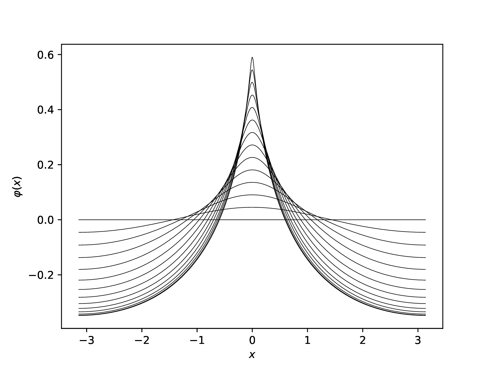

# Week 3 Lecture 2: Computer-assisted proofs for continuous problems

In the last lecture we looked at an example of a computer assisted
proof. The goal was to prove that the first Dirichlet eigenvalue of
regular polygons, ``\mathbb{P}_N``, is decreasing in the number of
vertices, ``N``, of the polygon. We focused on the problem of proving
this for a finite number of polygons, ``N = 3, 4, \dots, 64`` to be
more precise. In this lecture we will look at another of a
computer-assisted proof, in this case related to waves. Before we do
that, let us however go back to the example from the previous lecture
and discuss the main takeaways.

## Looking back at regular polygons

We were interested in showing that the first eigenvalue of regular
polygons is decreasing for ``N = 3, 4, \dots, 64``. The approach was
split into two parts

1. Compute approximate eigenvalues (and eigenfunctions) for each
   polygon using the Method of Particular Solutions.
2. Compute error bounds on the approximate eigenvalues using a theorem
   by Fox, Henrici and Moler.

From the approximations and the error bounds it is then relatively
straightforward to check that the eigenvalue is decreasing. Step 1
uses classical numerics and there is rigorous numerics involved. Step
2 is where the rigorous numerics came in. To get a bound for the error
we needed an upper bound for

``` math
\mu = \frac{\sqrt{|\Omega|}\sup_{x \in \partial \Omega}|u_{app}(x)|}{\|u_{app}\|_2}
```

which in turns require an upper bound for ``\sup_{x \in \partial
\Omega}|u_{app}(x)|`` and a lower bound for ``\|u_{app}\|_2``. We have
therefore reduced the problem of computing bounds on the error of our
approximation to computing bounds of certain properties of our
approximation, in this case the error on the boundary and the ``L^2``
norm.

Many computer-assisted proofs follow a similar path as the one above,
namely

1. Compute a numerical approximation using classical numerical methods.
2. Using pen and paper prove that there exist a solution within a
   certain distance of the approximation assuming we can bound certain
   properties of the approximation.
3. Compute bounds for these properties using rigorous numerical
   methods.
4. Depending on the problem one would finally need to use the computed
   bounds to verify the result one is trying to prove (such as the
   eigenvalues being decreasing).

Which of these parts are hard highly depends on the problem. The first
two steps can in some cases be very easy, in other cases extremely
hard. After all, almost the entire field of numerical analysis is
devoted to step 1 and to some extent step 2. The main part of this
course will be focused on step 3, how to actually bound the properties
that we need.

The goal of this week is to give you some examples of how an
interesting mathematical problem can be reduced to a rigorous numerics
problem. We are starting from the top, the mathematical problem, and
moving downwards to find what we actually have to bound in the end. In
the second half of the course, **Introduction to rigorous numerics**,
we will instead start from the bottom and work our way upwards. We
will start with the most basic thing the computer can do, floating
point arithmetic, and slowly work our way up to using this to for
example bound ``\sup_{x \in \partial \Omega}|u_{app}(x)|``.

## Highest cusped waves

Let us now take a look at another computer-assisted proof. This time
related to waves. There are two papers for this

- [Highest Cusped Waves for the Burgers-Hilbert
  Equation](https://doi.org/10.1007/s00205-023-01904-6)
- [Highest cusped waves for the fractional KdV
  equations](http://dx.doi.org/10.1016/j.jde.2024.05.016)

They largely follow the same approach, but for different parameter
values. Most of the things we will look at are similar in both papers,
but we will primarily focus on the second one.

We are interested in the fractional Korteweg-de Vries (KdV) equations,
in the periodic setting given by

``` math
f_{t} + f f_{x} = |D|^{\alpha}f_{x},\quad \text{ for } (x, t) \in \mathbb{T} \times \mathbb{R}.
```

TODO: Mention typo in paper?

Where ``|D|^{\alpha}`` is the Fourier multiplier operator given by

``` math
\widehat{|D|^{\alpha}f}(\xi) = |\xi|^{\alpha}\widehat{f}(\xi)
```

where the parameter ``\alpha`` may in general take any real value. For
``\alpha = 2`` and ``\alpha = 1`` it reduces to the classical KdV and
Benjamin-Ono equations, for ``\alpha = -2`` one gets the reduced
Ostrovsky equation. For ``\alpha = -1`` it reduces to the
Burgers-Hilbert equation. The first of the papers treats the case
``\alpha = -1`` and the second paper treats ``\alpha \in (-1, 0)``.

What we are interested in is traveling waves, solutions of the form
``f(x, t) = \varphi(x - ct)``, where ``c > 0`` denotes the wave speed.
In this case the equation reduces to

``` math
-c \varphi' + \varphi\varphi' = |D|^{\alpha} \varphi'.
```

The equation has a branch of even ``2\pi``-periodic, smooth traveling
wave solutions bifurcating from constant solutions. You can
numerically follow this branch, which gives you a sequence of
traveling waves. What you get is something like in the following
figure, which comes from [this
paper](https://arxiv.org/abs/2201.13159).



What you see numerically is that the waves approach a profile that has
a cusp at the top. The existence of a wave with a cusp at the point is
what we want to prove! Here is a plot of what these waves look like
for varying values of ``\alpha``.


Our proof for that these exist is computer-assisted and is what we
will take a look at.

### Proof of existence

The procedure will follow the same three steps as in the earlier
example.

1. Compute a numerical approximation using classical numerical
   methods.
2. Using pen and paper prove that there exist a solution within a
   certain distance of the approximation assuming we can bound certain
   properties of the approximation.
3. Compute bounds for these properties using rigorous numerical
   methods.

Before doing this we however need to massage the equation a bit to get
something that is easier to work with. If we let ``u(x) = c -
\varphi(x)`` we can write the equation as

``` math
\frac{1}{2}u^{2} = -\mathcal{H}^{\alpha}[u],
```

where ``\mathcal{H}`` is the operator

``` math
\mathcal{H}^{\alpha}[u](x) = |D|^{\alpha}u(x) - |D|^{\alpha}u(0).
```

#### Step 1: Finding a numerical approximation

Getting a good numerical approximation requires a bit of effort, in
particular the asymptotic behavior near ``x = 0`` needs careful
analysis. The details are however not important for our current goal.
What we end up with in the end is an approximation of the form

``` math
u_{\alpha}(x) = a_{\alpha,0}\tilde{C}_{1 - \alpha}(x)
  + \sum_{j = 1}^{N_{\alpha,0}} a_{\alpha,j}\tilde{C}_{1 - \alpha + jp_{\alpha}}(x)
  + \sum_{n = 1}^{N_{\alpha,1}} b_{\alpha,n}(\cos(nx) - 1).
```

Here the function ``\tilde{C}_s`` is a variant of the [Clausen
functions](https://en.wikipedia.org/wiki/Clausen_function). The
coefficients ``a_{\alpha,j}`` and ``b_{\alpha,n}`` are carefully
chosen to make this a good numerical approximation.

#### Step 2: Error bounds for approximation

The next step is to figure out how to go from our numerical
approximate solution to the existence of a true solution. Like many
computer-assisted proofs this will be based on a fixed-point argument.

The first step is to write our solution ``u`` as the approximation
``u_\alpha`` plus a weighted perturbation. For our purposes we can
take the weight to be ``|x|``, though in practice this needs to be
adjusted based on ``\alpha``. We thus write ``u`` as

``` math
u(x) = u_{\alpha}(x) + |x|v(x)
```

where ``u_{\alpha}`` is our numerical approximation and ``v`` is some
perturbation. Our goal is to prove that there exists a ``v`` so that
this gives us a solution to the equation. Inserting this ansatz into
the equation and solving for ``v`` gives us

``` math
v + \frac{1}{|x|u_{\alpha}}\mathcal{H}^\alpha[|x|v] =
-\frac{1}{|x|u_{\alpha}}\left(
  \mathcal{H}^\alpha[u_{\alpha}] + \frac{1}{2}u_{\alpha}^{2}
\right) - \frac{|x|}{2u_{\alpha}}v^{2}.
```

By introducing

``` math
T_{\alpha}[v] = -\frac{1}{|x|u_{\alpha}}\mathcal{H}^\alpha[|x|v],\quad
F_{\alpha}(x) = \frac{1}{|x|u_{\alpha}(x)}\left(\mathcal{H}^\alpha[u_{\alpha}](x) + \frac{1}{2}u_{\alpha}(x)^{2}\right),\quad
N_{\alpha}(x) = \frac{|x|}{2u_{\alpha}(x)}
```

this can be rewritten as

``` math
(I - T_{\alpha})v = -F_{\alpha} - N_{\alpha}v^{2}.
```

Assuming that ``I - T_{\alpha}`` is invertible gives us

``` math
v = (I - T_{\alpha})^{-1}\left(-F_{\alpha} - N_{\alpha}v^{2}\right) =: G_{\alpha}[v].
```

Proving the existence of a solution hence reduces to proving the
existence of a fixed point of the operator ``G_{\alpha}``.

Finally one can show that if we let

``` math
n_{\alpha} = \|N_{\alpha}\|_{L^{\infty}(\mathbb{T})},\quad
\delta_{\alpha} = \|F_{\alpha}\|_{L^{\infty}(\mathbb{T})},\quad
D_{\alpha} = \|T_{\alpha}\|,
```

then ``G_{\alpha}`` has a fixed point if ``D_{\alpha} < 1`` (so that
``I - T_{\alpha}`` is invertible) and

``` math
\delta_{\alpha} < \frac{(1 - D_{\alpha})^{2}}{4n_{\alpha}}.
```

Note that ``\delta_{\alpha}``, ``D_{\alpha}`` and ``n_{\alpha}`` only
depend on our approximation ``u_\alpha``. We have thus completed step
2, we have reduced the problem of proving existence to bounding some
properties of our numerical approximation.

#### Step 3: Bounding ``\delta_{\alpha}``, ``D_{\alpha}`` and ``n_{\alpha}``

The values ``\delta_{\alpha}``, ``D_{\alpha}`` and ``n_{\alpha}`` are
all given by the supremum of some function on the interval ``[0,
\pi]``. More precisely we have

``` math
n_{\alpha} = \sup_{x \in [0, \pi]} |N_{\alpha}(x)|,\quad
\delta_{\alpha} = \sup_{x \in [0, \pi]} |F_{\alpha}(x)|,\quad
D_{\alpha} = \sup_{x \in [0, \pi]} |\mathcal{T}_{\alpha}(x)|.
```

with ``N_{\alpha}`` and ``F_{\alpha}`` as above and

``` math
\mathcal{T}_{\alpha}(x) = \frac{1}{\pi |x||u_{\alpha}(x)|}
\int_{0}^{\pi}|I_{\alpha}(x, y)||y|\ dy.
```

Computing bounds therefore reduces to bounding these three functions
on the interval ``[0, \pi]``. How to do something like that is what we
will get to later in the course.

!!! note
    In this specific case, when the weight is just ``|x|``, computing
    the supremum away from ``x = 0`` is somewhat straightforward. Near
    ``x = 0`` more work is required due to the existence of removable
    singularities.

    When the weight is not just ``|x|``, significantly more work is
    required to handle ``\mathcal{T}_{\alpha}``. Near the endpoints
    ``\alpha = -1`` and ``\alpha = 0`` the approach also needs some
    adjustments to work.
